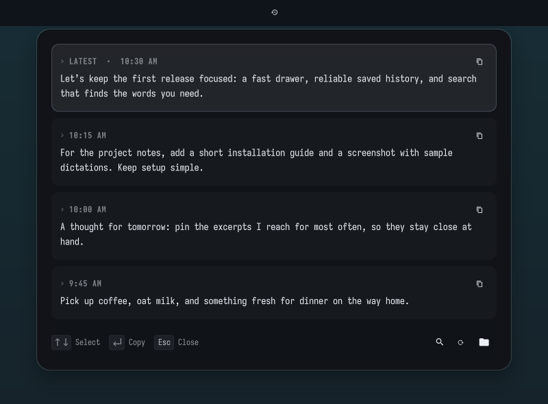
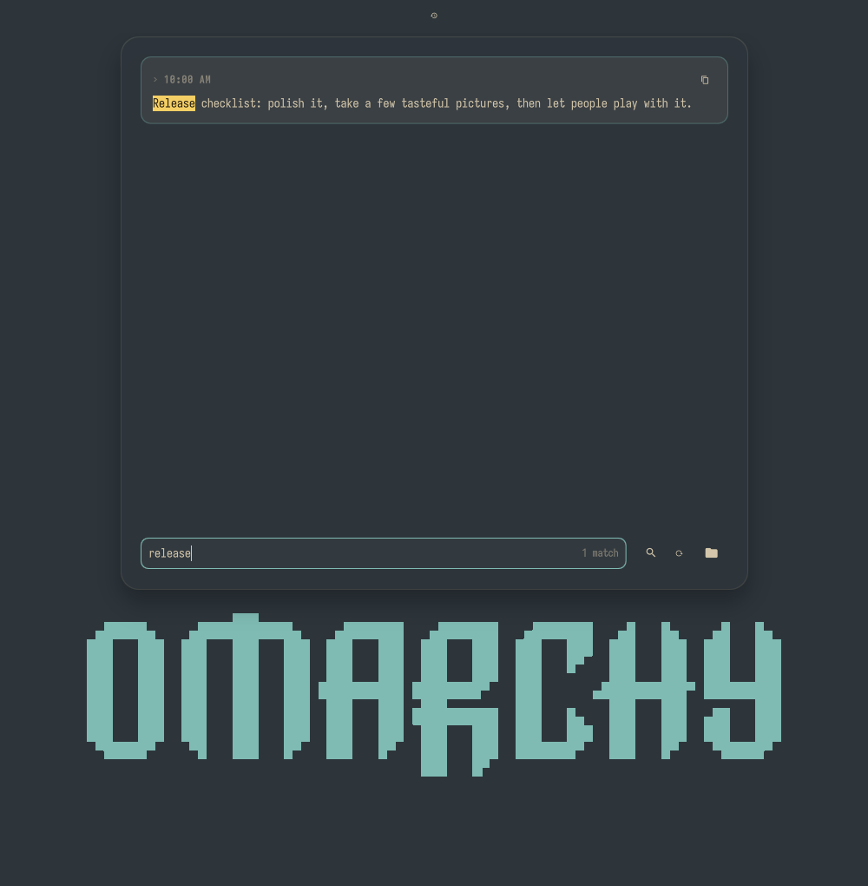
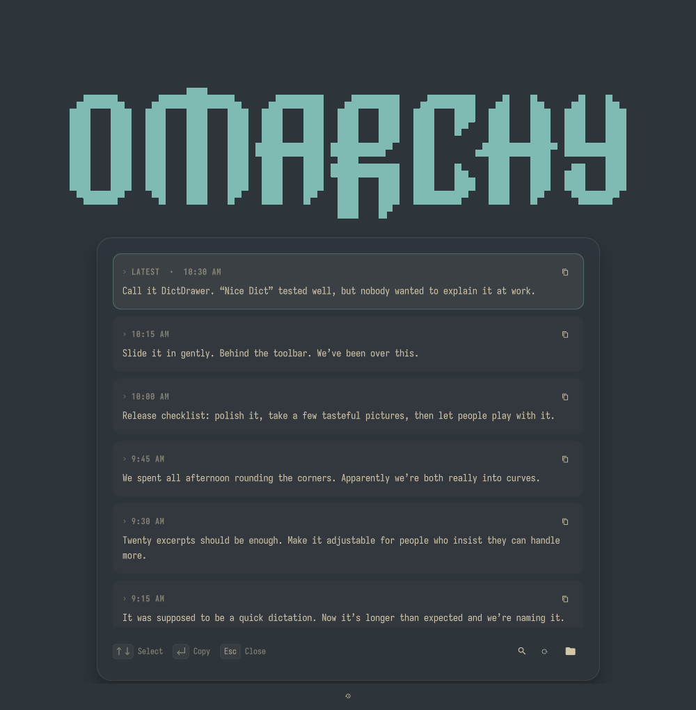

# DictDrawer

Your dictations, a keystroke away.

A searchable Voxtype history drawer for Omarchy. Recover an excerpt, find the words you need, and copy them back into your work.

> Private review build — not publicly released or listed in the marketplace. See the [release checklist](RELEASE_CHECKLIST.md) for remaining work.



Click the history icon to retrieve words that landed in the wrong window or reuse an earlier excerpt. The panel slides from behind the bar, follows your theme, and keeps its controls in the footer.

## Features

- Recovers existing Voxtype transcripts from the user journal.
- Saves plain-text excerpts locally and reads them back after journal rotation.
- Searches all saved transcripts, with case-insensitive, multiword matching, highlighted words, and context previews.
- Keyboard navigation, expandable excerpts, and clipboard copy with success/failure feedback.
- Top, bottom, left, and right bar layouts, with rounded corners and a subtle shadow.
- No Voxtype configuration changes, additional recording process, model downloads, or network requests.

## Requirements

Tested with Omarchy **4.0.2**, Quickshell **0.3.1**, Qt **6.11.2**, and Voxtype **1.0.1**. This plugin uses Omarchy's shared `qs.Ui` components; older shell versions have not been validated. `RectangularShadow` requires Qt 6.9 or later.

- A running Omarchy Quattro shell on Hyprland/Wayland.
- Voxtype running as the `voxtype.service` **user** service, with INFO-level transcription logs. Quiet logging cannot be recovered.
- Python 3.10+ and `journalctl` (systemd).
- `wl-copy` (`wl-clipboard`) for clipboard access.
- `xdg-open` (`xdg-utils`) and a file manager for the folder button.
- Omarchy's normal Nerd Font for the icons.

Enable Voxtype through Omarchy's Dictation setup if it is not already installed. Leave `state_file = "auto"` in its configuration for immediate archival when a dictation finishes. Opening or refreshing the drawer also imports history.

## Install

During private review, Git must already be authenticated with an account that has access to this repository. This is not yet a public installation URL.

```sh
omarchy plugin add https://github.com/BeerBelly69/omarchy-dictdrawer.git --enable
```

The helper is bundled in the plugin; no separate script installation is needed. To change the bar section:

```sh
omarchy bar move dictdrawer --section center
```

### Optional shortcut

The plugin does not install or replace keybindings. Check whether your preferred chord is free with `omarchy menu keybindings --print`, then add this to `~/.config/hypr/bindings.lua`:

```lua
o.bind("SUPER + ALT + apostrophe", "DictDrawer", "omarchy-shell shell toggle dictdrawer")
```

On a Mac keyboard, Super is the Command key. This shortcut is Cmd+Alt+the apostrophe/quote key, without Shift. Validate changes with `hyprctl reload` followed by `hyprctl configerrors`. The `shell toggle` route chooses the appropriate bar instance on a multi-monitor desktop.

## Use

| Action | Control |
| --- | --- |
| Open or close | History icon, or your optional shortcut |
| Select an excerpt | Up/Down or j/k |
| Expand / collapse | Right/Left or l/h; click the excerpt |
| Copy selection | Enter or Space; copy button on each row |
| Search | Magnifier, Ctrl+F, `/`, f, or Tab |
| Refresh from journal | Circular-arrow button |
| Open saved text files | Folder button |
| Close | Escape outside the search field, or click outside |

In the search field, arrows select results and Enter copies; ordinary letters remain editable. Escape first clears the query, then leaves search. A further Escape closes the drawer. Tab returns to list navigation. After copying, paste normally in your destination app.

Search matches every word you enter, regardless of order or case. It searches the full saved archive; the newest matching excerpts are displayed up to the widget's **Dictations shown** limit (5–100, default 20). Narrow the query to reach older matches. The result count shows the total number of matches, including any beyond the display limit.

Matching text is highlighted in yellow. Collapsed results show context around the first match, even deep in a long transcript; expand an excerpt to see all highlighted occurrences. Copy always copies the complete original transcript without formatting.

The drawer stays full-sized while searching, including when there are no matches. Results remain visible until the next search completes, with a small “Searching…” indicator in the field.



## Storage and privacy

The plugin reads only the `voxtype.service` user journal and its transcript directory. It never records audio or uploads transcripts. Enabling the widget enables local archival; there is no separate capture hook or config rewrite.

History lives in `$XDG_DATA_HOME/voxtype/history`, or `~/.local/share/voxtype/history` when XDG_DATA_HOME is unset. New transcripts are private (`0600`) text files with microsecond timestamps and content hashes in their names. New archive directories are created with mode `0700`. Existing directories and legacy files retain their permissions.

Older `YYYY-MM-DD_HHMMSS.txt` archives are read without rewriting them. Duplicate legacy copies are suppressed in the panel. New writes are atomic and do not overwrite existing files; manually edited archive text is preserved.

On first use, at most the newest **50,000 journal records** are imported. Subsequent imports resume from the newest saved timestamp with a one-second overlap. A warning appears if the import cap is reached or history is unavailable. Journal entries already removed by rotation cannot be recovered unless a saved transcript exists. The archive has no automatic retention limit in this release.

To stop archival, disable the widget:

```sh
omarchy plugin disable dictdrawer
```

To remove saved excerpts, use the folder button and your file manager. **Re-enabling or refreshing can recover deleted excerpts again while their source journal entries still exist.** The plugin does not erase system journals. Saving and deleting history are local operations, not a guarantee that every other copy has been erased.

## Remove

```sh
omarchy plugin remove dictdrawer
```

Remove the optional binding you added to `bindings.lua` and reload Hyprland. Saved transcripts remain in the history directory; remove them separately only if you want to discard them. There is no Voxtype hook to uninstall, and no service needs to be restarted.

## Troubleshooting

- **No transcripts:** check `systemctl --user status voxtype.service` and `journalctl --user -u voxtype.service`. This release recognizes Voxtype's `INFO Transcribed:` message format. Other services, custom state paths, and future log-format changes may need adaptation.
- **Copy fails:** confirm `wl-copy` is available and the shell is running in your Wayland session.
- **Archive warning:** check the history directory's permissions and available disk space. Saved history remains readable when the journal fails.
- **An edit does not appear:** try `omarchy-shell shell rescanPlugins`. Some shell versions retain cached QML; `omarchy restart shell` loads the new components.

## Development and validation

```sh
python3 -m unittest discover -s tests -v
omarchy plugin validate .
```

The automated tests use temporary files and mocked journals. They cover recovery after rotation, concurrent saves, timestamp collisions, legacy archives, literal Unicode search, edited files, unreadable files, and missing/failed journal commands. They do not require private transcripts or a running desktop.

Manual checks on Omarchy 4.0.2 covered top/bottom/left/right bar layouts, 1× and 1.5× monitors, search and no-match states, exact clipboard content, Escape dismissal, and rapid close/reopen. Screenshots use only authored sample text on a temporary preview background. These early preview captures predate highlighted search and the fixed-height results area; updated captures are on the release checklist.



## Related plugin

[Dictation (Voxtype) History](https://github.com/okurmustafa/omarchy-plugin-voxtype-history) is another history plugin with post-process capture, pinning, and deletion. This project focuses on a sliding drawer and recovery of existing journal history without adding a Voxtype hook.

## License

MIT. The drawer's focus and popup coordination are adapted from Omarchy's `Ui/KeyboardPanel.qml`; its copyright notice is retained in [LICENSE](LICENSE). The screenshots and sample dictations were created for this project.
